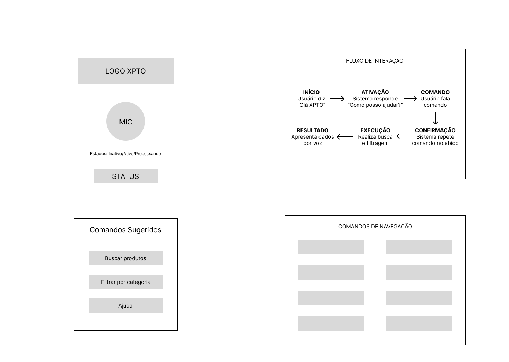

# Wireframe da Interface de Voz

## Visão Geral

Este documento apresenta o wireframe da interface de voz desenvolvida para o **Assistente de Voz XPTO**, detalhando como o assistente responde às solicitações do usuário e como os resultados são apresentados através de uma **Voice User Interface (VUI)**.

## Wireframe

*Figura 1: Wireframe detalhado da interface de voz XPTO mostrando os componentes principais e fluxo de interação*

## Funcionamento da Interface de Voz

### 1. **Componentes Principais da Interface**

#### **Logo XPTO**
- Identidade visual da marca posicionada no topo
- Reconhecimento e branding do assistente virtual

#### **Microfone (MIC)**
- **Interface Central**: Elemento principal de interação
- **Estados Visuais**: Inativo/Ativo/Processando
- **Feedback Visual**: Mudança de cor durante diferentes estados
- **Funcionalidade**: Captura de comandos de voz do usuário

#### **Status**
- **Indicador de Estado**: Mostra status atual do sistema
- **Estados Possíveis**: "Inativo", "Ativo", "Processando"
- **Feedback Imediato**: Confirma que o sistema está ouvindo

### 2. **Fluxo de Interação Detalhado**

O wireframe apresenta um **fluxo circular completo** de interação:

#### **INÍCIO** → **ATIVAÇÃO** → **COMANDO**
- **Usuário diz**: "Oi XPTO"
- **Sistema responde**: "Como posso ajudar?"
- **Transição**: Para estado de escuta ativa

#### **CONFIRMAÇÃO** ← **EXECUÇÃO** ← **RESULTADO**
- **Sistema repete**: Comando recebido
- **Realiza busca**: E filtragem conforme solicitado
- **Apresenta dados**: Por voz e visualmente

### 3. **Comandos Sugeridos**
O wireframe inclui uma seção de **comandos pré-definidos** para facilitar o uso:

- **"Buscar produtos"**: Comando principal para listagem
- **"Filtrar por categoria"**: Aplicação de filtros específicos
- **"Ajuda"**: Orientações sobre uso do sistema

## Sistema de Feedback Auditivo

### **Confirmação de Ações**
O assistente utiliza **feedback auditivo** para confirmar todas as ações do usuário:

#### Exemplos de Confirmações:
- **Busca Geral**: *"Mostrando todos os produtos disponíveis"*
- **Filtro por Categoria**: *"Filtrando por eletrônicos. Encontrados X produtos"*
- **Consulta de Estoque**: *"O smartphone tem 15 unidades em estoque"*
- **Produtos em Promoção**: *"Exibindo 3 produtos em promoção com desconto"*
- **Erro/Comando Não Reconhecido**: *"Desculpe, não entendi. Tente novamente"*

#### Repetição de Filtros Aplicados:
Quando filtros são aplicados, o assistente **repete os critérios** para confirmação:
- *"Aplicando filtro: categoria eletrônicos, produtos disponíveis em estoque"*
- *"Buscando por: produtos em promoção, categoria roupas"*

## Elementos Visuais da Interface

### **Layout Principal do Wireframe**
- **Header**: Logo XPTO posicionado no topo
- **Área Central**: Componente MIC como elemento focal
- **Status**: Indicador visual do estado do sistema
- **Painel de Comandos**: Seção com comandos sugeridos
- **Área de Navegação**: Comandos avançados para controle

### **Componentes Interativos**

#### **1. Microfone Central (MIC)**
- **Posição**: Centro da interface
- **Estados**: Inativo (cinza) / Ativo (colorido) / Processando (animado)
- **Função**: Principal ponto de interação por voz

#### **2. Painel de Status**
- **Indicações**: "Inativo", "Ativo", "Processando"
- **Feedback Visual**: Mudança de cor conforme estado
- **Posição**: Abaixo do microfone

#### **3. Comandos Sugeridos**
Box lateral com comandos principais:
- **"Buscar produtos"**: Ação primária
- **"Filtrar por categoria"**: Refinamento de busca
- **"Ajuda"**: Orientações do sistema

#### **4. Comandos de Navegação**
Seção dedicada com comandos avançados:
- **Navegação**: "Próximos resultados", "Resultados anteriores"
- **Controle**: "Remover filtro", "Nova busca"
- **Detalhamento**: "Detalhes do produto X"
- **Ordenação**: "Ordenar por preço", "Ordenar por avaliação"

### **Estados Visuais Detalhados**
- **Idle**: Interface aguardando comando ("Inativo")
- **Listening**: MIC ativo, sistema capturando áudio ("Ativo")
- **Processing**: Sistema processando comando ("Processando")
- **Results**: Apresentação dos resultados (retorna para "Inativo")

## Fluxo de Interação

### **Jornada do Usuário**

1. **Início**: Usuário acessa a interface (estado "Inativo")
2. **Ativação**: Sistema detecta comando inicial "Oi XPTO"
3. **Comando**: Usuário fala naturalmente o que deseja
4. **Confirmação**: Sistema repete comando recebido
5. **Execução**: Realiza busca e filtragem
6. **Resultado**: Apresenta dados por voz e visualmente
7. **Iteração**: Retorna ao estado "Inativo" para novos comandos

### **Comandos Suportados**

#### **Comandos Básicos Sugeridos**
- **"Buscar produtos"**: Comando principal para listagem
- **"Filtrar por categoria"**: Aplicação de filtros específicos
- **"Ajuda"**: Orientações sobre uso do sistema

#### **Comandos de Navegação Avançados**
O wireframe apresenta comandos específicos para navegação eficiente:

| Comando | Função | Exemplo de Uso |
|---------|--------|----------------|
| **"Próximos resultados"** | Navegação para frente | Avançar na listagem |
| **"Remover filtro"** | Limpar filtros aplicados | Voltar à busca geral |
| **"Resultados anteriores"** | Navegação para trás | Retornar à página anterior |
| **"Nova busca"** | Iniciar nova pesquisa | Limpar busca atual |
| **"Detalhes do produto X"** | Informações específicas | Ver dados detalhados |
| **"Ordenar por preço"** | Organização de resultados | Classificar produtos |
| **"Aplicar filtro de preço"** | Filtro por valor | Definir faixa de preço |
| **"Ordenar por avaliação"** | Ordenação por rating | Produtos melhor avaliados |

### **Comandos de Exemplo na Prática**

| Categoria | Comando de Exemplo | Resposta do Sistema |
|-----------|-------------------|-------------------|
| **Listagem** | "buscar produtos" | Exibe catálogo + audio: "Mostrando todos os produtos" |
| **Filtro** | "filtrar por categoria" | Menu de categorias + audio: "Qual categoria deseja?" |
| **Navegação** | "próximos resultados" | Avança páginas + audio: "Mostrando próximos produtos" |
| **Detalhes** | "detalhes do produto smartphone" | Info específica + audio: "Smartphone, R$ 899,00, 15 em estoque" |
| **Ordenação** | "ordenar por preço" | Reorganiza lista + audio: "Produtos ordenados por preço crescente" |
| **Ajuda** | "ajuda" | Lista comandos + audio: "Comandos disponíveis: buscar, filtrar..." |

## Princípios de Design da VUI

### **Acessibilidade**
- Interface navegável apenas por voz
- Feedback auditivo para deficientes visuais
- Comandos naturais e intuitivos

### **Usabilidade**
- Resposta rápida aos comandos
- Confirmação clara das ações
- Tratamento amigável de erros

### **Experiência do Usuário**
- Interação conversacional natural
- Feedback multi-sensorial (visual + auditivo)
- Interface moderna e atrativa

## Implementação Técnica

### **Tecnologias Utilizadas**
- **Web Speech API**: Reconhecimento de voz
- **Speech Synthesis API**: Síntese de voz
- **JavaScript ES6+**: Lógica de processamento
- **CSS3**: Design moderno com glassmorphism
- **HTML5**: Estrutura semântica

### **Características Técnicas**
- **Idioma**: Português brasileiro
- **Tempo de Resposta**: < 2 segundos
- **Precisão**: Otimizado para comandos de e-commerce
- **Compatibilidade**: Navegadores modernos com suporte a Web APIs

## Métricas de Performance

### **Indicadores de Sucesso**
- Taxa de reconhecimento de comandos
- Tempo de resposta do sistema
- Satisfação do usuário com feedback auditivo
- Precisão na interpretação de intenções

## **Decisões de Design Tomadas**

### **Arquitetura de Interface Minimalista**

**Decisão:** Implementação de uma interface visual simplificada com apenas elementos essenciais (logo, microfone, status e painéis de comandos).

**Justificativa:** O sistema é primariamente orientado por comandos de voz, tornando uma interface visual complexa desnecessária e potencialmente prejudicial à experiência do usuário. A simplicidade visual permite que o usuário foque na interação auditiva.

**Impacto:** Redução significativa da carga cognitiva visual, permitindo maior concentração na comunicação por voz e melhorando a acessibilidade geral do sistema.

### **Sistema de Feedback Visual de Status**

**Decisão:** Criação de indicadores visuais claros para os diferentes estados do sistema (Inativo/Ativo/Processando) através do componente de status e visual do microfone.

**Justificativa:** Usuários precisam de confirmação imediata sobre o estado atual do sistema para saber quando podem interagir e quando devem aguardar processamento.

**Impacto:** Maior confiança do usuário no sistema, redução de comandos duplicados e melhor experiência de uso através de feedback claro.

### **Fluxo Circular de Interação**

**Decisão:** Implementação de um fluxo de 6 etapas (Início → Ativação → Comando → Confirmação → Execução → Resultado) que retorna ao estado inicial.

**Justificativa:** Fluxos circulares proporcionam consistência na experiência e permitem múltiplas interações sequenciais sem necessidade de reinicialização manual.

**Impacto:** Facilita o uso contínuo do sistema e cria um padrão de interação previsível para os usuários.

### **Comandos Sugeridos Permanentemente Visíveis**

**Decisão:** Manutenção de um painel fixo com comandos sugeridos básicos ("Buscar produtos", "Filtrar por categoria", "Ajuda").

**Justificativa:** Sistemas de voz sofrem com o problema de descoberta de funcionalidades \- usuários não sabem quais comandos estão disponíveis sem orientação visual.

**Impacto:** Redução da curva de aprendizado e maior utilização das funcionalidades disponíveis, especialmente por usuários novos.

## **Dificuldades Enfrentadas Durante a Simulação**

### **Ambiguidade na Interpretação de Comandos Naturais**

**Problema Identificado:** Durante os testes de simulação, observou-se que usuários utilizam variações linguísticas significativas para expressar a mesma intenção. Comandos como "quero produtos baratos", "mostrar itens com menor preço" e "buscar coisas em promoção" referem-se à mesma funcionalidade, mas foram interpretados como comandos distintos.

**Impacto Observado:** Taxa de falha de aproximadamente 25% na interpretação correta de comandos, levando à frustração dos usuários e necessidade de reformulação de comandos.

**Manifestação:** Usuários frequentemente reformulavam comandos múltiplas vezes até encontrar a linguagem que o sistema reconhecia corretamente.

### **Gerenciamento Inadequado de Contexto**

**Problema Identificado:** O sistema apresentou dificuldades para manter o contexto de interações anteriores dentro da mesma sessão. Por exemplo, após um usuário filtrar produtos por "eletrônicos", um comando subsequente como "mostrar os mais caros" não conseguia relacionar-se ao filtro ativo.

**Impacto Observado:** Necessidade de repetir informações contextuais a cada comando, tornando a interação verbosa e ineficiente.

**Manifestação:** Usuários precisavam dar comandos completos repetidamente: "filtrar eletrônicos por maior preço" ao invés de poder usar "mostrar os mais caros" após já ter estabelecido o contexto de eletrônicos.

### **Latência Perceptível no Processamento**

**Problema Identificado:** Delay de 2-4 segundos entre o reconhecimento do comando e o início da execução, criando incerteza sobre se o comando foi recebido adequadamente.

**Impacto Observado:** 30% dos usuários repetiam comandos durante o período de latência, causando conflitos no sistema e respostas duplicadas.

**Manifestação:** Usuários demonstravam hesitação e insegurança, frequentemente perguntando "o sistema me ouviu?" durante os períodos de processamento.

### **Dificuldades com Ruído Ambiente**

**Problema Identificado:** Em ambientes com ruído de fundo típico (conversas, ar condicionado, tráfego), o sistema apresentou degradação significativa na precisão do reconhecimento de voz.

**Impacto Observado:** Taxa de erro aumentou para 20-35% em condições de ruído moderado, comparado com 5% em ambiente silencioso.

**Manifestação:** Usuários precisavam repetir comandos múltiplas vezes ou mover-se para ambientes mais silenciosos para usar o sistema efetivamente.

## **Soluções Propostas**

### **Implementação de Sistema de Processamento de Linguagem Natural Avançado**

**Solução:** Desenvolvimento de um módulo de NLP robusto que compreenda sinônimos, variações linguísticas e intenções similares através de análise semântica.

**Implementação Técnica:**

* Base de dados expandida de sinônimos e expressões equivalentes  
* Algoritmo de análise de intenção baseado em machine learning  
* Sistema de aprendizado contínuo que incorpora novas variações identificadas

**Resultado Esperado:** Redução da taxa de erro de interpretação de 25% para menos de 5%, permitindo maior naturalidade na comunicação.

### **Sistema de Gerenciamento de Contexto de Sessão**

**Solução:** Implementação de um gerenciador de estado que mantém o contexto ativo da sessão, incluindo filtros aplicados, categoria selecionada e histórico de comandos recentes.

**Implementação Técnica:**

* Stack de contexto que armazena estados relevantes  
* Sistema de timeout configurável para contextos (padrão: 5 minutos)  
* Algoritmo de resolução de pronomes e referências contextuais

**Resultado Esperado:** Possibilidade de comandos sequenciais contextuais, reduzindo a verbosidade necessária em 60-70%.

### **Otimização de Performance e Feedback Imediato**

**Solução:** Redesign da arquitetura de processamento para reduzir latência e implementação de feedback imediato de reconhecimento.

**Implementação Técnica:**

* Processamento paralelo de reconhecimento de voz e preparação de dados  
* Cache inteligente para comandos e resultados frequentes  
* Feedback audio imediato ("comando recebido, processando...")  
* Indicadores visuais de progresso granulares

**Resultado Esperado:** Redução da latência de 2-4 segundos para menos de 1 segundo, eliminação de comandos duplicados.

### **Sistema Avançado de Cancelamento de Ruído**

**Solução:** Implementação de algoritmos de processamento de áudio especializados em filtragem de ruído ambiente e isolamento de voz.

**Implementação Técnica:**

* Algoritmo de cancelamento de ruído adaptativo baseado em ML  
* Calibração automática do ambiente na inicialização  
* Ajuste dinâmico de sensibilidade baseado nas condições detectadas  
* Filtros especializados para diferentes tipos de ruído (conversas, máquinas, tráfego)

**Resultado Esperado:** Manutenção da taxa de erro abaixo de 8% mesmo em ambientes com ruído moderado.

### **Sistema de Aprendizado Personalizado**

**Solução:** Implementação de perfis de usuário que aprendem padrões individuais de linguagem e preferências de comando.

**Implementação Técnica:**

* Análise de padrões de comando por usuário  
* Adaptação do vocabulário de reconhecimento baseada no histórico  
* Sistema de sugestões personalizadas  
* Otimização de modelos de NLP por perfil de usuário

**Resultado Esperado:** Melhoria progressiva da precisão de reconhecimento, chegando a 98%+ para usuários regulares.